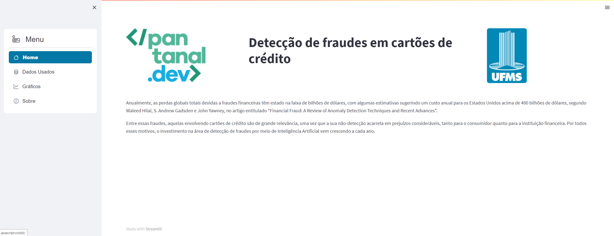

<h1 align="center">
  
  <br />
  <br />
  Fraud Watchdog | <a href="https://project-creditcard-fraud-detection.streamlit.app">Acessar</a>
</h1>

<p align="center"><i>"Proteção avançada contra fraudes em cartões de crédito para instituições financeiras."</i></p>

---

   <h2 align="center">Tópicos 📋</h2>

   <p>
   
   - [Sobre 📖](#sobre-)
   - [Layout 📱](#layout-)
   - [Tecnologias 🤖](#tecnologias-)
   - [Como utilizar 🤔](#como-utilizar-)
   - [Como contribuir 💪](#como-contribuir-para-o-projeto-)
   - [Autores 🦸](#autores-)

   </p>

---

<h2 align="center">Sobre 📖</h2>
   
<p align="center">
  Nossa solução de detecção de fraudes em cartões de crédito oferece uma abordagem proativa e inteligente para proteger instituições financeiras contra ameaças cibernéticas. Utilizando tecnologia de ponta e algoritmos avançados de aprendizado de máquina, nossa plataforma analisa padrões de comportamento, identifica transações suspeitas e fornece alertas em tempo real. Garantindo uma detecção precisa e reduzindo falsos positivos, nossa solução assegura transações seguras e mantém a confiança e lealdade dos clientes. Fortaleça a segurança financeira de sua instituição com nossa solução confiável e eficaz de combate às fraudes.
</p>

---

<h2 align="center">Layout 📱</h2>
  
  <p> 
      <div align = "center"></div>
      <div align = "center"></div>
      <div align = "center"></div>
   </p>

---

<h2 align="center">Tecnologias 🤖</h2>

   <p>

-   **[Python](https://www.python.org)**
-   **[Streamlit](https://streamlit.io)**
-   **[XGBoost](https://xgboost.readthedocs.io/en/stable/)**
-   **[Matplotlib](https://matplotlib.org)**
-   **[Seaborn](https://seaborn.pydata.org)**
-   **[Pandas](https://pandas.pydata.org)**
-   **[NumPy](https://numpy.org)**
-   **[Scikit Learn](https://scikit-learn.org/stable/)**
-   **[Plotly](https://plotly.com)**

   </p>

---

<h2 align="center">Como utilizar 🤔</h2>

   ```
   - Clone este repositório:
   $ git clone https://github.com/MarceloFBorba/Projeto-pantanal.git

   - Entre na pasta:
   $ cd Projeto-pantanal/code

   - para instalar as dependências:
   $ pip install requirements.txt

   - Execute o app: 
   $ streamlit run .\dashboard.py
   ```

---

<h2>Como contribuir para o projeto 💪</h2>

1. Faça um **fork** do projeto.
2. Crie uma nova branch com as suas alterações: `git checkout -b my-feature`
3. Salve as alterações e crie uma mensagem de commit contando o que você fez: `git commit -m "feature: My new feature"`
4. Envie as suas alterações: `git push origin my-feature`
5. Envie um Pull request detalhando suas mudanças

---

<h2>Autores 🦸</h2>

>Este projeto foi desenvolvido com o ❤️ por **[@Ícaro Coêlho](https://github.com/icarogga)**, **[@Marcelo Ferreira](https://github.com/MarceloFBorba)**, **[@Vitor Sousa](https://github.com/VitorSousaS)**, **[@Wallynson Rodrigo](https://github.com/wrodrigohs)** 👋🏽 Entre em contato!

<br />

[](https://www.linkedin.com/in/ícaro-coelho-3a5b60206/) 
[](https://www.linkedin.com/in/marcelo-ferreira-dev/) 
[](https://www.linkedin.com/in/vitor-de-sousa-santos/) 
[](https://www.linkedin.com/in/wrodrigohs/) 

---
